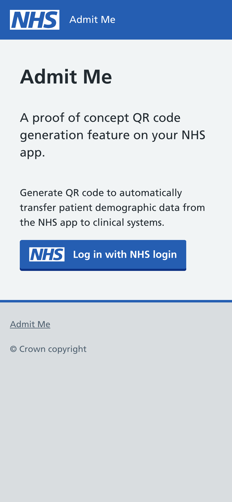
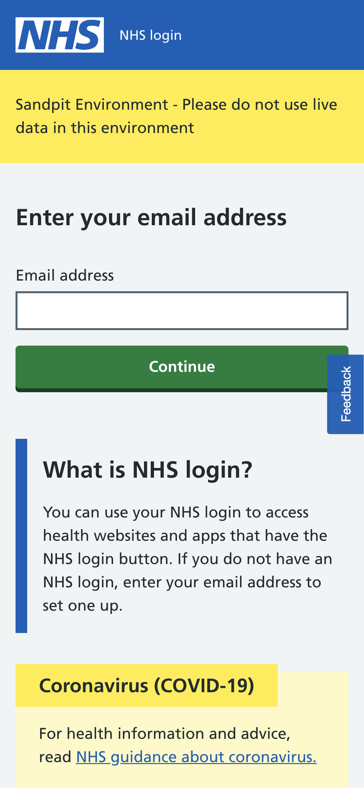
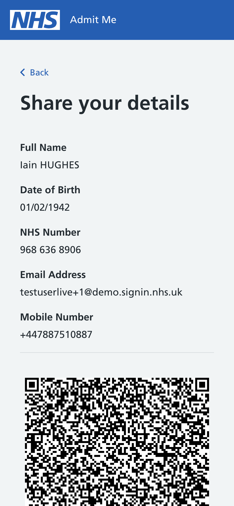

# NHSX Admit Me prototype

This is the source code for the Admit Me prototype which was developed by the NHSX Innovation Lab. 

This software was developed specifically to test how we might be able to save time, preserve patient privacy and reduce the potential to introduce errors (typos) into the patient record when admitting patients into care settings, using a QR code on their device.

The software uses [NHS login](https://nhsconnect.github.io/nhslogin/) to provide the user's data which is then encoded into a QR code. For this trial the [NHS login sandpit environment](https://nhsconnect.github.io/nhslogin/integrating-to-sandpit/) was used. If you wish to run the software yourself, you will need to configure your own sandpit environment (our configuration has not been shared for security purposes).  

The patient app prototype can be found [here](http://admit-me.services.nhs.uk/).
Use the following credentials to try out the user app:
```
Email address: testuserlive+1@demo.signin.nhs.uk
Password: Passw0rd$1
Security code: 190696
```
Screenshots from the patient app:

  

## Getting started

Clone the repository:
```
git clone https://github.com/nhsx/admitme.git
```

Open a command line and set the current directory to one of the three apps in the repo (admitme-ui for example):
```
cd admitme/admitme-ui
```

Install the project dependencies (this will need to be done for all three apps):
```
yarn install
```
You will then need to set up some environment variables - please see the Repository contents section below for more details.

Once the install is done and the enviroment is set up, run the app locally:
```
yarn start
```
This will start a localhost server running the app.


## Repository contents 

### admitme-pas

An app for scanning a QR code and displaying the patients data. Simulating the front desk software.

A ReactJS app with barcode scanner library.

You will need to create a ```.env``` file in the root of this folder and create two variables which will be used as the login details for the app:
```
REACT_APP_USER_ID=username
REACT_APP_PASSWORD=password
```

### admitme-ui 

The patient app using NHS login to generate a QR code.

A ReactJS frontend using NHS UI toolkit

To run the app you will need to have set up your own NHS login sandpit environment and create a config.js file with details.

You will need to create a ```.env``` file in the root of this folder and provide your NHS login sandpit client ID:
```
REACT_APP_NHS_LOGIN_CLIENT_ID=your_client_id
```

### admitme-backend

A service which is deployed on AWS Lambda to get user information from the NHS login sandpit environment. In the admitme-ui app, on return from NHS login, a token is received. This token is sent to this service to look up the user details which are passed back to the frontend app. These details are then used to generate a QR code in admitme-ui.

This service uses a [JSON web token](https://jwt.io/) to sign the request. A private key file is needed to sign it - you will need to provide your own for this. 

You will need to create a ```.env``` file in the root of this folder and provide your NHS login sandpit client ID:
```
NHS_LOGIN_CLIENT_ID=your_client_id
```

The backend can then be deployed to your own AWS cloud using serverless:
```
serverless deploy -v
```

## Get involved

If you're interested in contributing to this project or have any questions please reach out to me (Rob Walters):

- [Email](mailto:rob.walters@nhsx.nhs.uk)
- [GitHub](https://github.com/rjw558)

